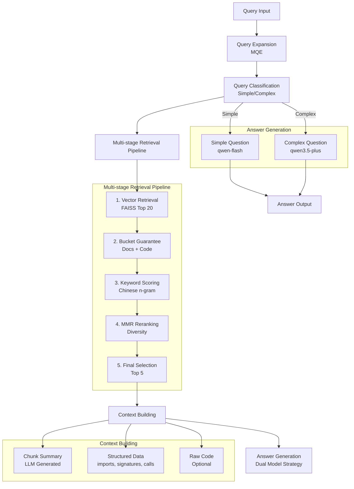

# RepoMind

[](https://www.python.org/)
[](https://fastapi.tiangolo.com/)
[](https://github.com/facebookresearch/faiss)
[](https://docs.pydantic.dev/)
[](https://platform.openai.com/)
[](https://modelcontextprotocol.io/)
[](LICENSE)

> 📖 **中文文档**: [README_zh.md](README_zh.md)

A code-aware RAG (Retrieval-Augmented Generation) system for repository understanding. RepoMind helps AI and developers efficiently explore unfamiliar codebases with token-efficient approaches.

## Table of Contents

- [Project Overview](#project-overview)
- [Problem & Use Cases](#problem--use-cases)
- [Core Features](#core-features)
- [Technical Highlights](#technical-highlights)
- [System Architecture](#system-architecture)
- [Quick Start](#quick-start)
- [Core Modules](#core-modules)
- [Evaluation Metrics](#evaluation-metrics)
- [Baseline Results](#baseline-results)
- [API Usage](#api-usage)
- [Project Structure](#project-structure)
- [Tech Stack](#tech-stack)
- [Development Progress](#development-progress)
- [Changelog](#changelog)

## Project Overview

RepoMind is a modular code repository understanding system that uses RAG technology to answer questions about codebases. It's specifically designed to help with **relatively static and niche codebases**, enabling both AI assistants and developers to understand unfamiliar code efficiently with significant token savings.

## Problem & Use Cases

### The Problem
- **Static/Niche Codebases**: Documentation is often outdated or missing for internal tools and less popular open-source projects
- **Token Inefficiency**: Sending entire files to LLMs is expensive and context-limited
- **Slow Onboarding**: New team members spend hours understanding code structure
- **AI Context Limitations**: LLMs struggle with large codebases without proper retrieval

### Use Cases
- **Enterprise Codebase Knowledge Base**: Help teams manage and query internal code repositories, enabling faster onboarding
- **Open Source Project Assistant**: Help developers quickly understand and use open-source projects
- **AI-Powered Programming Assistant**: Integrate with IDEs or AI tools to provide code context understanding

## Core Features

- **Multi-level Code-aware Chunking**: Python AST-based file/class/function/block chunking with structured data extraction
- **LLM Summary Generation**: Automatic LLM summary generation for each chunk during indexing, improving retrieval quality
- **Multi-stage Retrieval Pipeline**: Query expansion + vector search + metadata filtering + reranking
- **Chinese Keyword Optimization**: Chinese 2-gram + 3-gram matching with meaningless pronoun exclusion
- **Hybrid Answer Generation**: Fast model for simple questions, strong model for complex questions
- **Extensible Architecture**: Vector storage abstraction layer for future migration to Qdrant
- **FastAPI Service**: Production-ready API interface
- **MCP Service**: Model Context Protocol support for easy integration with AI tools

## Technical Highlights

### 1. Chunker Design: Multi-level Chunking
**Challenge**: Balancing granularity and context for optimal retrieval

**Solution**:
- **File-level**: Whole module overview with imports and top-level structure
- **Class-level**: Class responsibilities and methods
- **Function-level**: Function inputs, outputs, and call relationships
- **Block-level**: Code blocks in script files

**Trade-offs**: Finer granularity improves precision but may lose context; solved with LLM-generated summaries that preserve context while keeping individual chunks focused.

### 2. Reranker Design: Multi-factor Optimization
**Challenge**: Chinese queries require different handling, and diversity matters in retrieval results

**Solution**:
- **Chinese n-gram Matching**: 2-gram + 3-gram for better Chinese keyword matching
- **Meaningless Word Filter**: Exclusion table for Chinese pronouns ("我", "我们", "你", "你们", etc.)
- **Bucket Guarantee**: At least 1 document chunk + 1 code chunk to ensure diversity
- **MMR Diversity**: Maximal Marginal Relevance for result diversity
- **Weight Tuning**: alpha=0.85 (cosine similarity), beta=0.15 (keyword score) - keywords as "icing on the cake"

### 3. Token Efficiency Optimization
**Challenge**: Reducing token usage while maintaining answer quality

**Solution**:
- **LLM Summaries**: Use qwen-flash to generate concise summaries instead of sending full code
- **Dual Model Strategy**: Simple questions use fast model (qwen-flash), complex questions use strong model (qwen3.5-plus)
- **Structured Data**: Extract imports, signatures, calls instead of using full code
- **Smart Context Packing**: Prioritize summary > structured data > code

## System Architecture



## Quick Start

### Environment Requirements

- Python 3.9+
- Conda environment: `agentEnv`

### Installation

```bash
conda activate agentEnv
pip install -r requirements.txt
```

### Configuration

Copy `.env.example` to `.env` and configure:

```bash
cp .env.example .env
# Edit .env file, set QWEN_API_KEY
```

### Core Interface (Recommended)

Use the unified `RepoMind` class with all configurable options:

```python
from repomind import RepoMind

# Initialize with default configuration
repomind = RepoMind()

# Or with custom configuration
repomind = RepoMind(
    enable_query_expansion=True,      # Enable query expansion
    enable_query_classification=True,  # Enable question classification
    query_expansion_variants=2,         # Number of query expansion variants
    use_fast_llm_for_expansion=True,    # Use fast LLM for query expansion
    use_hybrid_answer_generation=True,  # Hybrid answer generation (fast for simple)
)

# Index a repository
repomind.index_repository("/path/to/repo")

# Query
result = repomind.query("What does this project do?")
print(result["answer"])
```

### Run Demo

```bash
conda activate agentEnv && python scripts/test_core.py
```

### Start API Service

```bash
conda activate agentEnv && uvicorn repomind.api.main:app --reload
```

API documentation: http://localhost:8000/docs

### Start MCP Service

RepoMind supports MCP (Model Context Protocol) for easy integration with Claude Desktop and other AI tools:

```bash
conda activate agentEnv && python scripts/start_mcp_server.py
```

**MCP Tools**:
- `index_repository(repo_path)` - Index a code repository
- `query_repository(question)` - Query an indexed repository
- `get_health()` - Check service health
- `save_index(index_path)` - Save index to disk
- `load_index(index_path)` - Load index from disk

**Claude Desktop Configuration**:
Add to Claude Desktop config:
```json
{
  "mcpServers": {
    "repomind": {
      "command": "conda",
      "args": ["run", "-n", "agentEnv", "python", "/path/to/RepoMind/scripts/start_mcp_server.py"]
    }
  }
}
```

## Core Modules

### 1. Ingestion

**Location**: `repomind/ingestion/`

- **chunker.py**: Multi-level code chunker
  - file level: Whole module overview
  - class level: Class responsibilities and methods
  - function level: Function inputs, outputs, and call relationships
  - block level: Code blocks in script files

- **summary_generator.py**: LLM summary generator
  - Uses qwen-flash for fast generation
  - Uses only structured data, not full code
  - Summary included in embedding text

- **models.py**: CodeChunk data model
  - chunk_type, name, signature, docstring
  - summary, structured_data
  - embedding_text (for embeddings)

### 2. Retrieval

**Location**: `repomind/retrieval/`

- **pipeline.py**: Multi-stage retrieval pipeline
  - Query expansion (MQE)
  - Vector search
  - Reranking

- **query_expander.py**: Query expander
  - Supports custom models
  - Generates multiple query variants

- **query_classifier.py**: Query classifier
  - simple/complex binary classification
  - Used for dual model strategy

- **reranker.py**: Reranker (Latest optimization!)
  - Bucket guarantee: At least 1 document + 1 code
  - Chinese optimization: 2-gram + 3-gram matching
  - Meaningless word filter: Chinese pronoun exclusion table
  - MMR diversity: Maximal Marginal Relevance
  - Weight tuning: alpha=0.85 (cosine), beta=0.15 (keywords)

### 3. Generation

**Location**: `repomind/generation/`

- **answer_generator.py**: Answer generator
  - Supports dual LLM Service
  - Smart model selection

- **llm_service.py**: LLM service wrapper
  - OpenAI compatible interface
  - Supports custom base_url and model

### 4. Evaluation

**Location**: `repomind/evaluation/`

- **retrieval_metrics.py**: Retrieval metrics
  - Recall
  - Hit Rate
  - Precision

- **llm_evaluator.py**: LLM answer evaluation
  - Sufficiency
  - Correctness
  - Grounding

- **llm_metrics.py**: LLM metrics aggregation
  - Answerable Rate
  - End-to-end Success Rate
  - Retrieval Gap

## Evaluation Metrics

### Retrieval Metrics

| Metric | Definition | Formula |
|--------|------------|---------|
| **Recall** | Fraction of relevant chunks retrieved | `|Retrieved ∩ Relevant| / |Relevant|` |
| **Hit Rate** | Fraction of questions with at least one relevant chunk | `1.0 if |Retrieved ∩ Relevant| > 0 else 0.0` |
| **Precision** | Fraction of retrieved chunks that are relevant | `|Retrieved ∩ Relevant| / |Retrieved|` |

All retrieval metrics are calculated at the file level using source file paths. See `repomind/evaluation/retrieval_metrics.py` for implementation details.

### LLM Evaluation Metrics

LLM-based evaluation uses qwen-flash to assess answer quality in three dimensions:

| Metric | Scale | Definition |
|--------|-------|------------|
| **Sufficiency** | 0-2 | Is the retrieved context sufficient to answer the question?<br/>2 = Fully sufficient, 1 = Partially sufficient, 0 = Not sufficient |
| **Correctness** | 0-2 | Is the answer correct and complete compared to ground truth?<br/>2 = Correct and complete, 1 = Partially correct, 0 = Incorrect |
| **Grounding** | 0-2 | Are all claims in the answer supported by the context?<br/>2 = Fully grounded, 1 = Partially grounded, 0 = Not grounded |

See `repomind/evaluation/llm_evaluator.py` for the prompt templates and evaluation logic.

### Aggregate Metrics

| Metric | Definition | Formula |
|--------|------------|---------|
| **Answerable Rate** | Fraction of questions with sufficiency == 2 | `count(sufficiency == 2) / N` |
| **End-to-end Success Rate** | Fraction of questions with correctness == 2 AND grounding == 2 | `count(correctness == 2 AND grounding == 2) / N` |
| **Retrieval Gap** | Average gap between sufficiency and correctness | `avg(sufficiency - correctness)` |
| **Avg Sufficiency** | Average sufficiency score across all questions | `sum(sufficiency) / N` |
| **Avg Correctness** | Average correctness score across all questions | `sum(correctness) / N` |
| **Avg Grounding** | Average grounding score across all questions | `sum(grounding) / N` |

See `repomind/evaluation/llm_metrics.py` for implementation details.

### Performance Metrics

| Metric | Definition |
|--------|------------|
| **Avg Latency** | Average query response time in milliseconds |
| **Avg Total Token** | Average total tokens consumed per query (prompt + completion) |
| **Avg Prompt Token** | Average prompt tokens per query |
| **Avg Completion Token** | Average completion tokens per query |

## Baseline Results

### Test Projects

1. **travel_agent** (small): LLM-based travel assistant agent
2. **cuezero** (medium-large): High-performance billiards AI system

### Tested Systems

| System | Description |
|--------|-------------|
| LLM-only | No retrieval |
| Naive RAG | File-level chunks |
| Structured RAG | Function-level chunks |
| Full System | Full optimization (qwen3.5-plus) |
| Full System Fast | Full optimization + dual model strategy (qwen-flash + qwen3.5-plus) |

### travel_agent Results

| System | Avg Recall | Avg Hit Rate | Answerable Rate | E2E Success Rate | Avg Correctness | Avg Grounding | Avg Total Token | Avg Latency(ms) |
|--------|-----------|-----------|---------|------------|-----------|-----------|-----------|------------|
| llm_only | 0.000 | 0.000 | 0.0% | 40.0% | 2.00 | 0.80 | 3136 | 14463.6 |
| naive_rag | 1.000 | 1.000 | 90.0% | 100.0% | 2.00 | 2.00 | 3163 | 12789.5 |
| structured_rag | 0.975 | 1.000 | 80.0% | 100.0% | 2.00 | 2.00 | 2686 | 13869.1 |
| full_system | 0.975 | 1.000 | 90.0% | 100.0% | 2.00 | 2.00 | 2845 | 37362.6 |
| full_system_fast | 0.975 | 1.000 | 90.0% | 100.0% | 2.00 | 2.00 | 2502 | 15157.2 |

### cuezero Results

| System | Avg Recall | Avg Hit Rate | Answerable Rate | E2E Success Rate | Avg Correctness | Avg Grounding | Avg Total Token | Avg Latency(ms) |
|--------|-----------|-----------|---------|------------|-----------|-----------|-----------|------------|
| llm_only | 0.000 | 0.000 | 0.0% | 50.0% | 2.00 | 1.00 | 3590 | 21760.5 |
| naive_rag | 0.500 | 1.000 | 100.0% | 100.0% | 2.00 | 2.00 | 14100 | 15034.3 |
| structured_rag | 0.400 | 0.900 | 70.0% | 70.0% | 1.70 | 2.00 | 3420 | 20691.7 |
| full_system | 0.450 | 1.000 | 100.0% | 80.0% | 1.70 | 2.00 | 2313 | 48915.8 |
| full_system_fast | 0.450 | 1.000 | 100.0% | 90.0% | 1.80 | 2.00 | 1634 | 14342.8 |

### Key Improvements (chinese_rerank_fix)

1. **Chinese Keyword Matching Optimization**
   - Added 2-gram + 3-gram matching
   - Meaningless pronoun exclusion table ("我", "我们", "你", "你们", etc.)
   - README_zh.md can now be correctly retrieved!

2. **Weight Tuning**
   - alpha=0.85 (cosine similarity weight)
   - beta=0.15 (keyword score weight)
   - Keyword score as "icing on the cake", not the primary factor

3. **Bucket Guarantee**
   - At least 1 document chunk
   - At least 1 code chunk
   - Ensures diversity in retrieval results

## API Usage

### Index Repository

```bash
POST /index
{
  "repo_path": "/path/to/repository"
}
```

### Query Repository

```bash
POST /query
{
  "question": "What does this project do?"
}
```

## Project Structure

```
repomind/
├── repomind/
│   ├── ingestion/          # Data parsing and preprocessing
│   │   ├── chunker.py      # Multi-level code chunker
│   │   ├── summary_generator.py  # LLM summary generation
│   │   └── models.py       # CodeChunk data model
│   ├── indexing/           # Embedding and vector indexing
│   │   └── embedding_service.py
│   ├── storage/            # Vector storage abstraction
│   │   ├── vector_store.py # Abstract base class
│   │   └── faiss_store.py  # FAISS implementation
│   ├── retrieval/          # Multi-stage retrieval pipeline
│   │   ├── pipeline.py     # Main retrieval flow
│   │   ├── query_expander.py  # Query expansion
│   │   ├── query_classifier.py  # Query classification
│   │   └── reranker.py     # Reranker (Chinese optimization)
│   ├── generation/         # LLM answer generation
│   │   ├── answer_generator.py
│   │   └── llm_service.py
│   ├── evaluation/         # Evaluation metrics
│   │   ├── retrieval_metrics.py
│   │   ├── llm_evaluator.py
│   │   ├── llm_metrics.py
│   │   └── result_parser.py
│   ├── api/                # FastAPI service
│   │   ├── main.py
│   │   └── schemas.py
│   ├── mcp/                # MCP service
│   │   └── server.py
│   ├── configs/            # Configuration management
│   │   └── settings.py
│   ├── baselines/          # Baseline systems
│   │   ├── naive_rag.py
│   │   ├── structured_rag.py
│   │   ├── full_system.py
│   │   └── full_system_fast.py
│   └── core.py             # RepoMind core class
├── test_suite/             # Test suite
│   ├── travel_agent/
│   │   ├── test_questions.json
│   │   ├── test_questions.md
│   │   └── expected_sources.json
│   └── cuezero/
│       ├── test_questions.json
│       ├── test_questions.md
│       └── expected_sources.json
├── scripts/                # Utility scripts
│   ├── run_baseline_comparison.py
│   ├── analyze_baseline_results.py
│   ├── run_full_llm_eval.py
│   ├── start_mcp_server.py
│   └── ...
├── tests/                  # Test suite
│   ├── test_api.py
│   ├── test_storage.py
│   └── ...
├── requirements.txt
└── README.md
```

## Tech Stack

- **Vector Storage**: FAISS (Facebook AI Similarity Search)
- **Embedding Model**: text-embedding-v4
- **Strong LLM**: qwen3.5-plus - for final answer generation
- **Fast LLM**: qwen-flash - for query expansion, question classification, chunk summary generation, LLM evaluation
- **API Framework**: FastAPI
- **Data Modeling**: Pydantic v2

## Development Progress

- [x] Phase 1: Core Infrastructure
- [x] Phase 2: Data Models & Ingestion
- [x] Phase 3: Embedding & Storage
- [x] Phase 4: Retrieval Pipeline
- [x] Phase 5: Generation Module
- [x] Phase 6: Evaluation & API
- [x] Phase 7: Documentation & Commit
- [x] Phase 8: Baseline Comparison Tests
- [x] Phase 9: Fast LLM Tiered Implementation
- [x] Phase 10: Multi-level Chunk + LLM Summary
- [x] Phase 11: Chinese Reranker Optimization
- [x] Phase 12: Project Completion & Finalization (FAISS Enhancement / MCP Service / Documentation Updates)

## Changelog

### 2026-03-26: Project Completion & Finalization

**Key Improvements**:
- **FAISS Middleware Enhancement**: Added delete, update, clear, get_chunks_by_file, count, exists methods
- **MCP Service Support**: Added MCP (Model Context Protocol) server for easy integration with Claude Desktop and other AI tools
- **FastAPI Unit Tests**: Added API endpoint tests
- **README Update**: Enhanced baseline results table with Avg Correctness, Avg Grounding, Avg Total Token metrics

**New Files**:
- `repomind/mcp/server.py` - MCP server
- `scripts/start_mcp_server.py` - MCP service startup script
- `tests/test_api.py` - FastAPI unit tests

### 2026-03-26: Chinese Reranker Optimization

**Key Improvements**:
- Added Chinese 2-gram + 3-gram matching
- Added Chinese meaningless pronoun exclusion table
- Adjusted weights: alpha=0.85 (cosine similarity), beta=0.15 (keyword score)
- README_zh.md can now be correctly retrieved

**Test Results**:
- travel_agent: Recall 0.975, Hit Rate 1.000, E2E Success Rate 100.0%
- cuezero: Recall 0.450, Hit Rate 1.000, Answerable Rate 100.0%

### 2026-03-24: Multi-level Chunk + LLM Summary

**Key Improvements**:
- Multi-level chunk architecture (file / class / function / block)
- Structured information extraction (imports, signatures, calls, etc.)
- LLM summary generation framework (using qwen-flash model)
- Automatic LLM summaries generation during indexing

### 2026-03-23: Chunker Bug Fixes

**Fixed Bugs**:
- Duplicate Chunks - Issue where class methods were extracted twice
- `_is_top_level` always returning True - Added parent attribute setting to correctly distinguish class methods from top-level functions
- Missing module-level context - Now supports multi-level chunks
- Pure script files couldn't be chunked - Added script block chunking support

## License

MIT License
