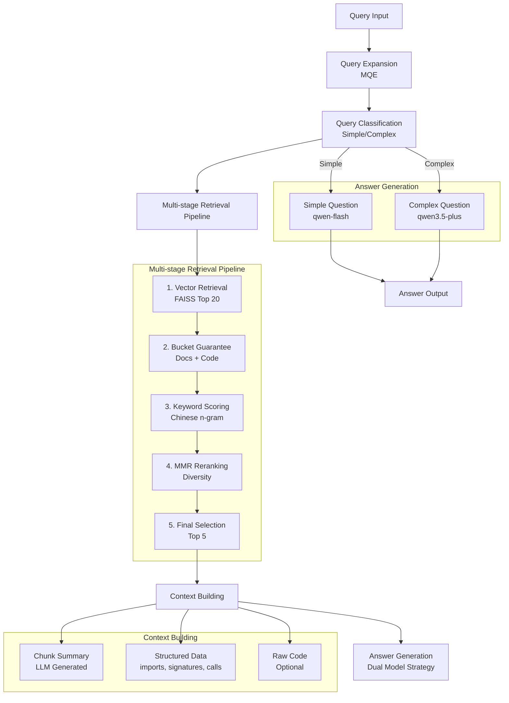

<h1 align="center">RepoMind</h1>

---

<p align="center">
  <a href="https://www.python.org/">
    
  </a>
  <a href="https://fastapi.tiangolo.com/">
    
  </a>
  <a href="https://github.com/facebookresearch/faiss">
    
  </a>
  <a href="https://docs.pydantic.dev/">
    
  </a>
  <a href="https://platform.openai.com/">
    
  </a>
  <a href="https://modelcontextprotocol.io/">
    
  </a>
  <a href="LICENSE">
    
  </a>
</p>

<p align="center">
  <a href="README_zh.md">📖 中文文档</a>
  •
  <a href="CHANGELOG.md">📝 Changelog</a>
</p>

<p align="center">
  A <b>highly token-efficient code-aware RAG system</b> specialized for repository understanding.
</p>

<p align="center">
  ~80% token reduction vs naive RAG on large codebases, while maintaining comparable accuracy.
</p>

---

<p align="center">
  <a href="#-highlights">Highlights</a>
  •
  <a href="#-performance--key-insight">Performance</a>
  •
  <a href="#-use-cases">Use Cases</a>
  •
  <a href="#-technical-highlights">Deep Dive</a>
  •
  <a href="#-system-architecture">Architecture</a>
  •
  <a href="#-quick-start">Quick Start</a>
  •
  <a href="#-baseline-results">Results</a>
  •
  <a href="docs/MODULES.md">Modules</a>
  •
  <a href="docs/METRICS.md">Metrics</a>
</p>

---

## 🔥 Highlights

- **Specialized Code Chunking**: AST-aware file/class/function/block chunking with structured data extraction
- **LLM Summary Generation**: Auto-generated chunk summaries during indexing for better retrieval quality
- **Multi-stage Retrieval Pipeline**: Query expansion + vector search + metadata filtering + reranking
- **Chinese Optimization**: n-gram matching with meaningless pronoun exclusion
- **Token Efficiency**: ~80% token reduction vs non-optimized RAG on large repos (14100 → 1634 tokens)
- **Dual Model Strategy**: Fast model for simple questions, strong model for complex questions, ensuring accuracy while optimizing cost and latency
- **Extensible Architecture**: Vector storage abstraction layer for future migration
- **FastAPI & MCP Support**: Production-ready API and Model Context Protocol for easy integration

## 📊 Performance / Key Insight

### The Trade-off

| Approach | Recall | Cost |
|----------|--------|------|
| **Naive RAG** | High | Very High (full files) |
| **RepoMind** | Comparable | **~80% lower** (summaries + structured data) |

### Key Results

- **Small repos**: Comparable or slightly better accuracy than naive RAG
- **Large repos**: ~5-10% lower accuracy in single-query setting, but massive token savings
- **Token reduction**: ~88% on medium-large projects (14100 → 1634 tokens), ~21% on small projects (3163 → 2502 tokens)

See [full baseline results](#-baseline-results) below for detailed metrics.

## 🎯 Use Cases

- **AI Agent Context Provider**: Integrate with Claude Desktop or other AI tools via MCP to provide codebase context with minimal token overhead
- **Large Repo Exploration**: Efficiently navigate and understand internal tools or niche open-source projects without sending entire files to LLMs
- **Team Knowledge Base**: Help new team members onboard faster by answering codebase questions with grounded, verifiable answers

## 🔧 Deep Dive

### 1. Chunker Design: Multi-level Chunking
**Challenge**: Balancing granularity and context for optimal retrieval

**Solution**:
- **File-level**: Whole module overview with imports and top-level structure
- **Class-level**: Class responsibilities and methods
- **Function-level**: Function inputs, outputs, and call relationships
- **Block-level**: Code blocks in script files

**Trade-offs**: Finer granularity improves precision but may lose context; solved with low-cost fast LLM-generated summaries that preserve context while keeping individual chunks focused.

### 2. Reranker Design: Multi-factor Optimization
**Challenge**: Chinese queries require different handling, and diversity matters in retrieval results

**Solution**:
- **Chinese n-gram Matching**: 2-gram + 3-gram for better Chinese keyword matching
- **Meaningless Word Filter**: Exclusion table for Chinese pronouns ("我", "我们", "你", "你们", etc.)
- **Bucket Guarantee**: At least 1 document chunk + 1 code chunk to ensure diversity
- **MMR Diversity**: Maximal Marginal Relevance for result diversity
- **Weight Tuning**: alpha=0.85 (cosine similarity), beta=0.15 (keyword score) - keywords as "icing on the cake"

### 3. Token Efficiency Optimization
**Challenge**: Reducing token usage while maintaining answer quality

**Solution**:
- **LLM Summaries**: Use low-cost fast LLM (default: qwen-flash) to generate concise summaries instead of sending full code
- **Dual Model Strategy**: Simple questions use fast model (qwen-flash), complex questions use strong model (qwen3.5-plus), saving cost and optimizing response speed
- **Structured Data**: Extract imports, signatures, calls instead of using full code
- **Smart Context Packing**: Prioritize summary > structured data > code

## 🏗️ System Architecture



## 🚀 Quick Start

### Environment Requirements

- Python 3.9+
- Conda environment: `RepoMind`

### Installation

```bash
conda create -n RepoMind python=3.11
pip install -r requirements.txt
```

### Configuration

Copy `.env.example` to `.env` and configure:

```bash
cp .env.example .env
# Edit .env file, set QWEN_API_KEY
```

### Core Interface (Recommended)

Use the unified `RepoMind` class with all configurable options:

```python
from repomind import RepoMind

# Initialize with default configuration
repomind = RepoMind()

# Or with custom configuration
repomind = RepoMind(
    enable_query_expansion=True,      # Enable query expansion (MQE)
    enable_query_classification=True,  # Enable question classification
    query_expansion_variants=2,         # Number of query expansion variants
    use_fast_llm_for_expansion=True,    # Use fast LLM for query expansion
    use_hybrid_answer_generation=True,  # Hybrid answer generation (fast for simple)
)

# Index a repository
repomind.index_repository("/path/to/repo")

# Query
result = repomind.query("What does this project do?")
print(result["answer"])
```

### Run Demo

```bash
conda activate agentEnv && python scripts/test_core.py
```

### Start API Service

```bash
conda activate agentEnv && uvicorn repomind.api.main:app --reload
```

#### Index Repository

```bash
POST /index
{
  "repo_path": "/path/to/repository"
}
```

#### Query Repository

```bash
POST /query
{
  "question": "What does this project do?"
}
```

Full API documentation: http://localhost:8000/docs

### Start MCP Service

RepoMind supports MCP (Model Context Protocol) for integration with Claude Desktop, Claude Code, and other AI tools:

```bash
conda activate agentEnv && python scripts/start_mcp_server.py
```

**MCP Tools**:
- `index_repository(repo_path)` - Index a code repository
- `query_repository(question)` - Query an indexed repository
- `get_health()` - Check service health
- `save_index(index_path)` - Save index to disk
- `load_index(index_path)` - Load index from disk

**Claude Desktop Configuration**:
Add to Claude Desktop config:
```json
{
  "mcpServers": {
    "repomind": {
      "command": "conda",
      "args": ["run", "-n", "RepoMind", "python", "/path/to/RepoMind/scripts/start_mcp_server.py"]
    }
  }
}
```

## 📦 Core Modules

See [docs/MODULES.md](docs/MODULES.md).

## 📈 Baseline Results

### Test Projects

For evaluation metrics, see [docs/METRICS.md](docs/METRICS.md). Tested projects:

1. **travel_agent** (small): LLM-based travel assistant agent
2. **cuezero** (medium-large): High-performance billiards AI system

### Tested Systems

| System | Description |
|--------|-------------|
| LLM-only | No retrieval (specific files provided as context, with necessary truncation for large files to save cost) |
| Naive RAG | Non-optimized generic RAG implementation, using file-level chunks to avoid recall degradation from fragmented splitting |
| Structured RAG | Complete ingestion pipeline + naive retrieval + naive rerank |
| Full System | Full optimization (qwen3.5-plus) |
| Full System Fast | Full optimization + dual model strategy (qwen-flash + qwen3.5-plus) |

### travel_agent Results

| System | Avg Recall | Avg Hit Rate | Answerable Rate | E2E Success Rate | Avg Correctness | Avg Grounding | Avg Total Token | Avg Latency(ms) |
|--------|-----------|-----------|---------|------------|-----------|-----------|-----------|------------|
| llm_only | 0.000 | 0.000 | 0.0% | 40.0% | 2.00 | 0.80 | 3136 | 14463.6 |
| naive_rag | 1.000 | 1.000 | 90.0% | 100.0% | 2.00 | 2.00 | 3163 | 12789.5 |
| structured_rag | 0.975 | 1.000 | 80.0% | 100.0% | 2.00 | 2.00 | 2686 | 13869.1 |
| full_system | 0.975 | 1.000 | 90.0% | 100.0% | 2.00 | 2.00 | 2845 | 37362.6 |
| full_system_fast | 0.975 | 1.000 | 90.0% | 100.0% | 2.00 | 2.00 | 2502 | 15157.2 |

### cuezero Results

| System | Avg Recall | Avg Hit Rate | Answerable Rate | E2E Success Rate | Avg Correctness | Avg Grounding | Avg Total Token | Avg Latency(ms) |
|--------|-----------|-----------|---------|------------|-----------|-----------|-----------|------------|
| llm_only | 0.000 | 0.000 | 0.0% | 50.0% | 2.00 | 1.00 | 3590 | 21760.5 |
| naive_rag | 0.500 | 1.000 | 100.0% | 100.0% | 2.00 | 2.00 | 14100 | 15034.3 |
| structured_rag | 0.400 | 0.900 | 70.0% | 70.0% | 1.70 | 2.00 | 3420 | 20691.7 |
| full_system | 0.450 | 1.000 | 100.0% | 80.0% | 1.70 | 2.00 | 2313 | 48915.8 |
| full_system_fast | 0.450 | 1.000 | 100.0% | 90.0% | 1.80 | 2.00 | 1634 | 14342.8 |

Average latency may be slightly higher due to network reasons. Actual performance can be referenced based on actual business conditions and llm_only values. This is for comparison purposes only.

---

## 📁 Project Structure

```
repomind/
├── repomind/
│   ├── ingestion/          # Data parsing and preprocessing
│   ├── indexing/           # Embedding and vector indexing
│   ├── storage/            # Vector storage abstraction
│   ├── retrieval/          # Multi-stage retrieval pipeline
│   ├── generation/         # LLM answer generation
│   ├── evaluation/         # Evaluation metrics
│   ├── api/                # FastAPI service
│   ├── mcp/                # MCP service
│   ├── configs/            # Configuration management
│   ├── baselines/          # Baseline systems
│   └── core.py             # RepoMind core class
├── test_suite/             # Test suite
├── scripts/                # Utility scripts
├── tests/                  # Test suite
├── requirements.txt
├── README.md
├── README_zh.md
└── CHANGELOG.md
```

---

## 🛠️ Tech Stack

- **Vector Storage**: FAISS (Facebook AI Similarity Search)
- **Embedding Model**: text-embedding-v4
- **Strong LLM**: qwen3.5-plus - for final answer generation
- **Fast LLM**: qwen-flash - for query expansion, question classification, chunk summary generation, LLM evaluation
- **API Framework**: FastAPI
- **Data Modeling**: Pydantic v2

---

## 📝 Changelog

See [CHANGELOG.md](CHANGELOG.md) for a detailed history of changes.

---

## 📄 License

MIT License
