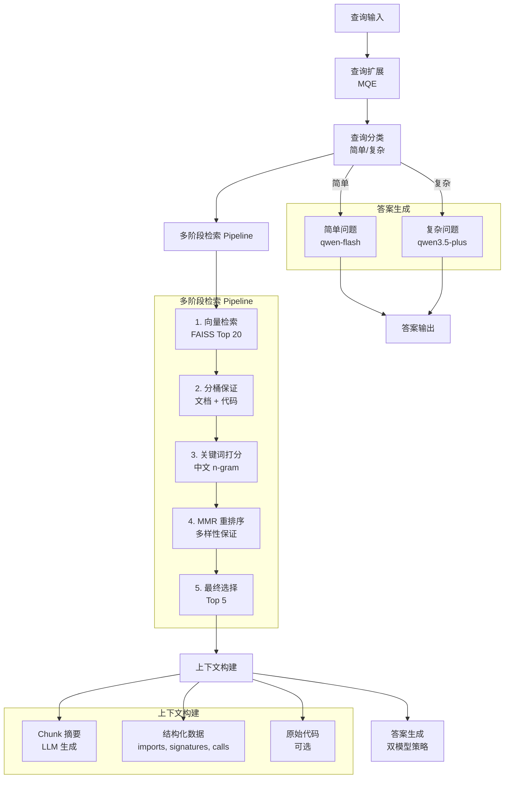

<h1 align="center">RepoMind</h1>

---

<p align="center">
  <a href="https://www.python.org/">
    
  </a>
  <a href="https://fastapi.tiangolo.com/">
    
  </a>
  <a href="https://github.com/facebookresearch/faiss">
    
  </a>
  <a href="https://docs.pydantic.dev/">
    
  </a>
  <a href="https://platform.openai.com/">
    
  </a>
  <a href="https://modelcontextprotocol.io/">
    
  </a>
  <a href="LICENSE">
    
  </a>
</p>

<p align="center">
  <a href="README.md">📖 English Documentation</a>
  •
  <a href="CHANGELOG.md">📝 更新记录</a>
</p>

<p align="center">
  一个 <b>节省 Token 的代码感知 RAG 系统</b>，用于仓库理解。
</p>

<p align="center">
  在大型代码库上相比 naive RAG 节省 ~80% Token，同时保持相当的准确率。
</p>

---

<p align="center">
  <a href="#-亮点">亮点</a>
  •
  <a href="#-性能--核心洞察">性能</a>
  •
  <a href="#-应用场景">场景</a>
  •
  <a href="#-核心特性">特性</a>
  •
  <a href="#-技术亮点">亮点</a>
  •
  <a href="#-系统架构">架构</a>
  •
  <a href="#-快速开始">快速开始</a>
  •
  <a href="#-核心模块">模块</a>
  •
  <a href="#-基线测试结果">结果</a>
</p>

---

## 🔥 亮点

- **多级代码分块**：基于 AST 的 file/class/function/block 多级分块，带结构化数据提取
- **LLM 摘要生成**：建库时自动为每个 chunk 生成 LLM 摘要，提升检索质量
- **中文优化**：2-gram + 3-gram 匹配，无意义代词排除
- **Token 效率**：大型仓库相比 naive RAG 节省 ~80% Token（14100 → 1634 tokens）
- **双模型策略**：简单问题用 fast 模型，复杂问题用 strong 模型
- **MCP 支持**：Model Context Protocol 支持，轻松接入 AI 工具

## 📊 性能 / 核心洞察

### 权衡对比

| 方案 | 召回率 | 成本 |
|------|--------|------|
| **Naive RAG** | 高 | 非常高（整个文件） |
| **RepoMind** | 相当 | **~80% 更低**（摘要 + 结构化数据） |

### 关键结果

- **小仓库**：与 naive RAG 相比，准确率相当或略高
- **大仓库**：单查询场景下准确率低 ~5-10%，但 Token 节省巨大
- **Token 减少**：cuezero 上 88%（14100 → 1634 tokens），travel_agent 上 21%（3163 → 2502 tokens）

详细指标见下方[完整基线测试结果](#-基线测试结果)。

## 🎯 应用场景

- **AI Agent 上下文提供者**：通过 MCP 与 Claude Desktop 等 AI 工具集成，以最小 Token 开销提供代码库上下文
- **大型仓库探索**：高效导航和理解内部工具或冷门开源项目，无需将整个文件发送给 LLM
- **团队知识库**：帮助新团队成员更快上手，通过有根据、可验证的答案回答代码库问题

## ✨ 核心特性

- **多级代码感知分块**：基于 Python AST 的 file/class/function/block 多级分块，带结构化数据提取
- **LLM 摘要生成**：建库时自动为每个 chunk 生成 LLM 摘要，提升检索质量
- **多阶段检索 Pipeline**：查询扩展 + 向量搜索 + 元数据过滤 + 重排序
- **中文关键词优化**：支持中文 2-gram + 3-gram 匹配，无意义代词排除
- **混合答案生成**：简单问题用 fast 模型，复杂问题用 strong 模型
- **可扩展架构**：向量存储抽象层，便于未来迁移到 Qdrant
- **FastAPI 服务**：生产就绪的 API 接口
- **MCP 服务**：支持 Model Context Protocol，便于接入其他 AI 工具

## 🔧 技术亮点

### 1. Chunker 设计：多级分块
**挑战**：在粒度和上下文之间取得平衡以实现最佳检索

**解决方案**：
- **文件级**：整个模块概览，包含 imports 和顶层结构
- **类级**：类的职责和方法
- **函数级**：函数的输入输出和调用关系
- **块级**：脚本文件中的代码块

**权衡**：更细的粒度提高了精度，但可能失去上下文；通过 LLM 生成的摘要解决，在保持单个 chunk 专注的同时保留上下文。

### 2. Reranker 设计：多因素优化
**挑战**：中文查询需要不同的处理方式，检索结果的多样性很重要

**解决方案**：
- **中文 n-gram 匹配**：2-gram + 3-gram 以实现更好的中文关键词匹配
- **无意义词过滤**：中文代词排除表（"我"、"我们"、"你"、"你们"等）
- **分桶保证**：至少 1 个文档 chunk + 1 个代码 chunk 以确保多样性
- **MMR 多样性**：最大边际相关性以确保结果多样性
- **权重调整**：alpha=0.85（余弦相似度），beta=0.15（关键词分数）- 关键词作为"锦上添花"

### 3. Token 效率优化
**挑战**：在保持答案质量的同时减少 Token 使用

**解决方案**：
- **LLM 摘要**：使用 qwen-flash 生成简洁摘要，而不是发送完整代码
- **双模型策略**：简单问题使用 fast 模型（qwen-flash），复杂问题使用 strong 模型（qwen3.5-plus）
- **结构化数据**：提取 imports、signatures、calls 而不是使用完整代码
- **智能上下文打包**：优先顺序：摘要 > 结构化数据 > 代码

## 🏗️ 系统架构



## 🚀 快速开始

### 环境要求

- Python 3.9+
- Conda 环境：`agentEnv`

### 安装依赖

```bash
conda activate agentEnv
pip install -r requirements.txt
```

### 配置环境变量

复制 `.env.example` 为 `.env` 并配置：

```bash
cp .env.example .env
# 编辑 .env 文件，设置 QWEN_API_KEY
```

### 使用核心接口（推荐）

直接使用统一的 `RepoMind` 类，提供所有可配置选项：

```python
from repomind import RepoMind

# 初始化（使用默认配置）
repomind = RepoMind()

# 或自定义配置
repomind = RepoMind(
    enable_query_expansion=True,      # 启用查询扩展
    enable_query_classification=True,  # 启用问题分类
    query_expansion_variants=2,         # 查询扩展变体数量
    use_fast_llm_for_expansion=True,    # 查询扩展用 fast LLM
    use_hybrid_answer_generation=True,  # 混合答案生成（简单问题用 fast）
)

# 索引仓库
repomind.index_repository("/path/to/repo")

# 查询
result = repomind.query("这个项目是做什么的？")
print(result["answer"])
```

### 运行 Demo 测试

```bash
conda activate agentEnv && python scripts/test_core.py
```

### 启动 API 服务

```bash
conda activate agentEnv && uvicorn repomind.api.main:app --reload
```

API 文档访问：http://localhost:8000/docs

### 启动 MCP 服务

RepoMind 支持 MCP (Model Context Protocol)，可以轻松接入 Claude Desktop 等支持 MCP 的 AI 工具：

```bash
conda activate agentEnv && python scripts/start_mcp_server.py
```

**MCP 工具列表**：
- `index_repository(repo_path)` - 索引代码仓库
- `query_repository(question)` - 查询已索引的仓库
- `get_health()` - 检查服务健康状态
- `save_index(index_path)` - 保存索引到磁盘
- `load_index(index_path)` - 从磁盘加载索引

**Claude Desktop 配置示例**：
在 Claude Desktop 的配置文件中添加：
```json
{
  "mcpServers": {
    "repomind": {
      "command": "conda",
      "args": ["run", "-n", "agentEnv", "python", "/path/to/RepoMind/scripts/start_mcp_server.py"]
    }
  }
}
```

## 📦 核心模块

### 1. Ingestion（数据摄入）

**位置**：`repomind/ingestion/`

- **chunker.py**：多级代码分块器
  - file 级：整个模块概览
  - class 级：类的职责和方法
  - function 级：函数的输入输出和调用关系
  - block 级：脚本文件中的代码块

- **summary_generator.py**：LLM 摘要生成器
  - 使用 qwen-flash 快速生成
  - 仅用结构化数据，不用完整代码
  - 摘要内容包含在嵌入文本中

- **models.py**：CodeChunk 数据模型
  - chunk_type, name, signature, docstring
  - summary, structured_data
  - embedding_text（用于嵌入）

### 2. Retrieval（检索）

**位置**：`repomind/retrieval/`

- **pipeline.py**：多阶段检索 Pipeline
  - 查询扩展 (MQE)
  - 向量搜索
  - 重排序

- **query_expander.py**：查询扩展器
  - 支持自定义模型
  - 生成多个查询变体

- **query_classifier.py**：查询分类器
  - simple/complex 二分类
  - 用于双模型策略

- **reranker.py**：重排序器（最新优化！）
  - 分桶保证：至少 1 个文档 + 1 个代码
  - 中文优化：2-gram + 3-gram 匹配
  - 无意义词过滤：中文代词排除表
  - MMR 多样性：Maximal Marginal Relevance
  - 权重调整：alpha=0.85（余弦），beta=0.15（关键词）

### 3. Generation（答案生成）

**位置**：`repomind/generation/`

- **answer_generator.py**：答案生成器
  - 支持双 LLM Service
  - 智能选择模型

- **llm_service.py**：LLM 服务封装
  - OpenAI 兼容接口
  - 支持自定义 base_url 和 model

### 4. Evaluation（评估）

**位置**：`repomind/evaluation/`

- **retrieval_metrics.py**：检索指标
  - 召回率
  - 命中率
  - 精确率

- **llm_evaluator.py**：LLM 答案评估
  - 充分性
  - 正确性
  - 事实性

- **llm_metrics.py**：LLM 指标聚合
  - 可回答率
  - 端到端成功率
  - 检索差距

## 📊 评估指标

### 检索指标

| 指标 | 定义 | 公式 |
|------|------|------|
| **召回率** | 检索到的相关 chunk 比例 | `\|检索到的 ∩ 相关的\| / \|相关的\|` |
| **命中率** | 至少检索到一个相关 chunk 的查询比例 | `1.0 如果 \|检索到的 ∩ 相关的\| > 0 否则 0.0` |
| **精确率** | 检索到的 chunk 中相关的比例 | `\|检索到的 ∩ 相关的\| / \|检索到的\|` |

所有检索指标都在文件级别使用源文件路径计算。详见 `repomind/evaluation/retrieval_metrics.py`。

### LLM 评估指标

基于 LLM 的评估使用 qwen-flash 从三个维度评估答案质量：

| 指标 | 分值 | 定义 |
|------|------|------|
| **充分性** | 0-2 | 检索到的上下文是否足以回答问题？<br/>2 = 完全充分，1 = 部分充分，0 = 不充分 |
| **正确性** | 0-2 | 与标准答案相比，答案是否正确和完整？<br/>2 = 正确且完整，1 = 部分正确，0 = 不正确 |
| **事实性** | 0-2 | 答案中的所有主张是否都有上下文支持？<br/>2 = 完全有根据，1 = 部分有根据，0 = 无根据 |

详见 `repomind/evaluation/llm_evaluator.py` 中的提示词模板和评估逻辑。

### 聚合指标

| 指标 | 定义 | 公式 |
|------|------|------|
| **可回答率** | 充分性 == 2 的查询比例 | `count(充分性 == 2) / N` |
| **端到端成功率** | 正确性 == 2 且 事实性 == 2 的查询比例 | `count(正确性 == 2 且 事实性 == 2) / N` |
| **检索差距** | 充分性与正确性之间的平均差距 | `avg(充分性 - 正确性)` |
| **平均充分性** | 所有查询的平均充分性分数 | `sum(充分性) / N` |
| **平均正确性** | 所有查询的平均正确性分数 | `sum(正确性) / N` |
| **平均事实性** | 所有查询的平均事实性分数 | `sum(事实性) / N` |

详见 `repomind/evaluation/llm_metrics.py`。

### 性能指标

| 指标 | 定义 |
|------|------|
| **平均延迟** | 平均查询响应时间（毫秒） |
| **平均总 Token** | 平均每个查询消耗的总 Token（Prompt + Completion） |
| **平均 Prompt Token** | 平均每个查询的 Prompt Token |
| **平均 Completion Token** | 平均每个查询的 Completion Token |

## 📈 基线测试结果

### 测试项目

1. **travel_agent**（小项目）：基于 LLM 的旅行助手 Agent
2. **cuezero**（中大型项目）：高性能台球 AI 系统

### 测试系统

| 系统 | 特点 |
|------|------|
| LLM-only | 无检索 |
| Naive RAG | 文件级 chunk |
| Structured RAG | 函数级 chunk |
| Full System | 完整优化（qwen3.5-plus） |
| Full System Fast | 完整优化 + 双模型策略（qwen-flash + qwen3.5-plus） |

### travel_agent 项目结果

| 系统 | 平均召回率 | 平均命中率 | 可回答率 | 端到端成功率 | 平均正确性 | 平均事实性 | 平均总Token | 平均延迟(ms) |
|------|-----------|-----------|---------|------------|-----------|-----------|-----------|------------|
| llm_only | 0.000 | 0.000 | 0.0% | 40.0% | 2.00 | 0.80 | 3136 | 14463.6 |
| naive_rag | 1.000 | 1.000 | 90.0% | 100.0% | 2.00 | 2.00 | 3163 | 12789.5 |
| structured_rag | 0.975 | 1.000 | 80.0% | 100.0% | 2.00 | 2.00 | 2686 | 13869.1 |
| full_system | 0.975 | 1.000 | 90.0% | 100.0% | 2.00 | 2.00 | 2845 | 37362.6 |
| full_system_fast | 0.975 | 1.000 | 90.0% | 100.0% | 2.00 | 2.00 | 2502 | 15157.2 |

### cuezero 项目结果

| 系统 | 平均召回率 | 平均命中率 | 可回答率 | 端到端成功率 | 平均正确性 | 平均事实性 | 平均总Token | 平均延迟(ms) |
|------|-----------|-----------|---------|------------|-----------|-----------|-----------|------------|
| llm_only | 0.000 | 0.000 | 0.0% | 50.0% | 2.00 | 1.00 | 3590 | 21760.5 |
| naive_rag | 0.500 | 1.000 | 100.0% | 100.0% | 2.00 | 2.00 | 14100 | 15034.3 |
| structured_rag | 0.400 | 0.900 | 70.0% | 70.0% | 1.70 | 2.00 | 3420 | 20691.7 |
| full_system | 0.450 | 1.000 | 100.0% | 80.0% | 1.70 | 2.00 | 2313 | 48915.8 |
| full_system_fast | 0.450 | 1.000 | 100.0% | 90.0% | 1.80 | 2.00 | 1634 | 14342.8 |

### 关键改进 (chinese_rerank_fix)

1. **中文关键词匹配优化**
   - 添加 2-gram + 3-gram 匹配
   - 无意义代词排除表（"我"、"我们"、"你"、"你们"等）
   - README_zh.md 现在能正确被检索出来了！

2. **权重调整**
   - alpha=0.85（余弦相似度权重）
   - beta=0.15（关键词分数权重）
   - 关键词分数作为"锦上添花"，不是主要决定因素

3. **分桶保证**
   - 至少 1 个文档 chunk
   - 至少 1 个代码 chunk
   - 确保检索结果的多样性

---

## 📡 API 使用

### 索引仓库

```bash
POST /index
{
  "repo_path": "/path/to/repository"
}
```

### 查询仓库

```bash
POST /query
{
  "question": "这个项目是做什么的？"
}
```

---

## 📁 项目结构

```
repomind/
├── repomind/
│   ├── ingestion/          # 数据解析与预处理
│   ├── indexing/           # 嵌入与向量索引
│   ├── storage/            # 向量存储抽象
│   ├── retrieval/          # 多阶段检索 pipeline
│   ├── generation/         # LLM 答案生成
│   ├── evaluation/         # 评估指标
│   ├── api/                # FastAPI 服务
│   ├── mcp/                # MCP 服务
│   ├── configs/            # 配置管理
│   ├── baselines/          # 基线系统
│   └── core.py             # RepoMind 核心类
├── test_suite/             # 测试集
├── scripts/                # 工具脚本
├── tests/                  # 测试套件
├── requirements.txt
├── README.md
├── README_zh.md
└── CHANGELOG.md
```

---

## 🛠️ 技术栈

- **向量存储**：FAISS（Facebook AI Similarity Search）
- **嵌入模型**：text-embedding-v4
- **强 LLM**：qwen3.5-plus - 用于最终答案生成
- **快 LLM**：qwen-flash - 用于查询扩展、问题分类、chunk 摘要生成、LLM 评估
- **API 框架**：FastAPI
- **数据模型**：Pydantic v2

---

## 📝 更新记录

详细的更新历史请查看 [CHANGELOG.md](CHANGELOG.md)。

---

## 📄 许可证

MIT License
